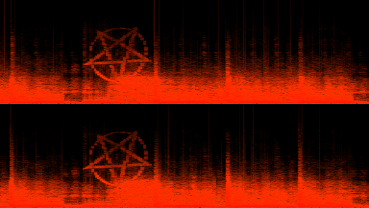
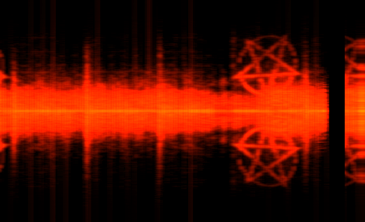

# magic
several custom visualizations for Magic Music Visuals, [magicmusicvisuals.com](https://magicmusicvisuals.com/)

| project                                                | screenshot                                               | description                                                                                                                                   |
|--------------------------------------------------------|----------------------------------------------------------|-----------------------------------------------------------------------------------------------------------------------------------------------|
| rolling-spectrogram.magic                              |       | red stereo spectrogram continuously rolling from right to left, designed i.a. to visualize Mick Gordon's Cyberdaemon easter egg               |
| overwriting-spectrogram.magic                          |  | red mirrored stereo spectrogram overwriting from left to right, designed i.a. to visualize Mick Gordon's Cyberdaemon easter egg               |
| rgb-lights-based-on-frequencies-decay-stereo-avg.magic |                                                          | mixing RGB lights according to averaged stereo frequencies (low: R, mid: B, high: G), component lightness corresponds to frequency band power |
 | music-responsive-jpeg-folder-kaleidoscope.magic       |                                                          | random pictures from a folder presented as kaleidoscope animations, speed of change reacts to music                                           |
| two-shaded-spheres-natural-real-low-amplitude.magic    | N/A                                                      | explicit, dancing breasts using custom GLSL shader                                                                                            |                                                              |